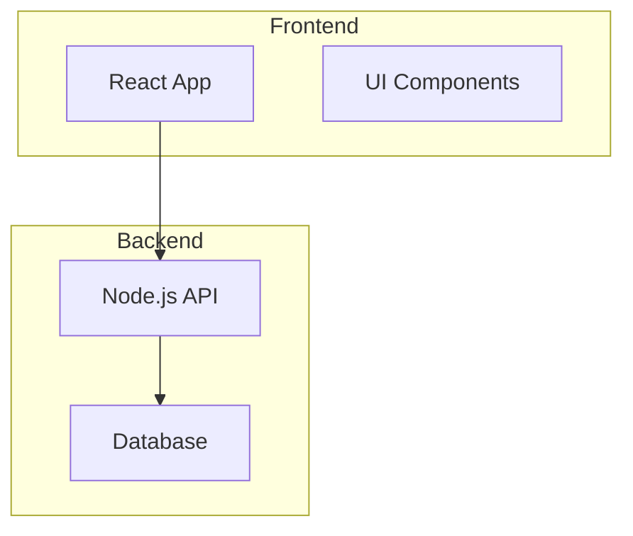
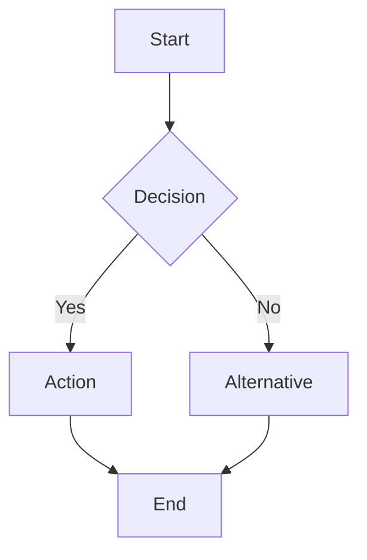
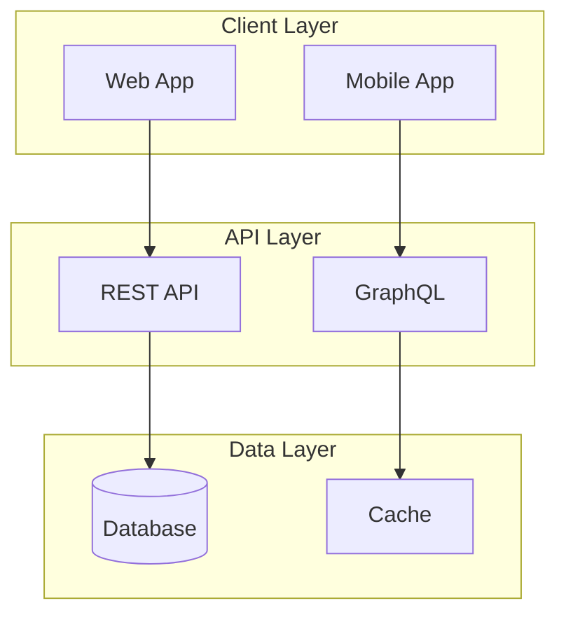
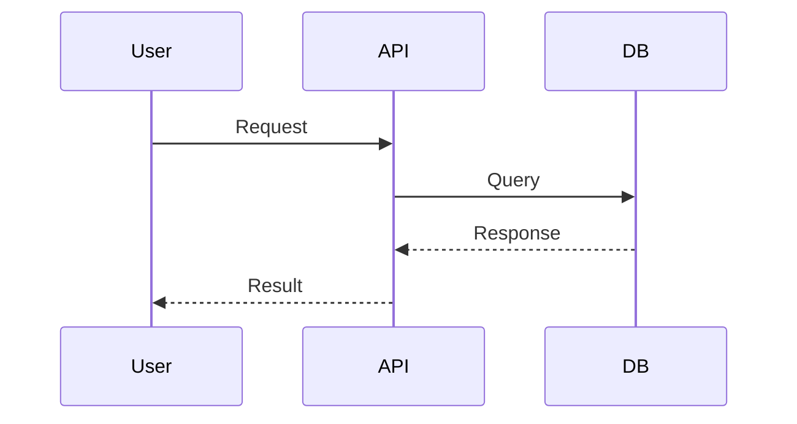

# Adding Architecture Diagrams & Flowcharts to Projects

This guide explains how to add visual diagrams to your project showcase.

## Methods

### 1. **Mermaid Diagrams (Recommended)**

Mermaid is a text-based diagramming tool that's perfect for architecture and flowcharts.

#### Architecture Diagram Example:


#### Flowchart Example:
```typescript
flowchart: `graph TD
    A[Start] --> B{Decision?}
    B -->|Yes| C[Action 1]
    B -->|No| D[Action 2]
    C --> E[End]
    D --> E`
```

### 2. **Custom Images**

For complex diagrams, you can use custom images:

```typescript
architectureImage: '/images/project-architecture.png'
```

Place images in the `public/images/` folder.

## Mermaid Syntax Guide

### Flowcharts


### Architecture Diagrams


### Sequence Diagrams


## Adding to Projects

Edit `src/components/Projects.tsx` and add to your project object:

```typescript
{
  title: 'My Project',
  // ... other fields
  architecture: `graph TB
    A[Component 1] --> B[Component 2]`,
  flowchart: `graph TD
    Start --> Process --> End`,
  features: [
    'Feature 1',
    'Feature 2',
    'Feature 3'
  ],
  architectureImage: '/images/my-architecture.png' // Optional
}
```

## Mermaid Diagram Types

- **Flowcharts**: `graph TD` or `graph LR`
- **Sequence Diagrams**: `sequenceDiagram`
- **Class Diagrams**: `classDiagram`
- **State Diagrams**: `stateDiagram-v2`
- **ER Diagrams**: `erDiagram`
- **Gantt Charts**: `gantt`

## Tips

1. **Keep diagrams simple** - Focus on key components and flows
2. **Use subgraphs** - Group related components
3. **Add labels** - Make relationships clear
4. **Test syntax** - Use [Mermaid Live Editor](https://mermaid.live/) to test
5. **Use custom images** - For complex diagrams that Mermaid can't handle

## Examples

See the `AI Chat Assistant`, `Multi-Agent AI System`, and `RAG Knowledge Base` projects in `Projects.tsx` for examples of how to add diagrams.
